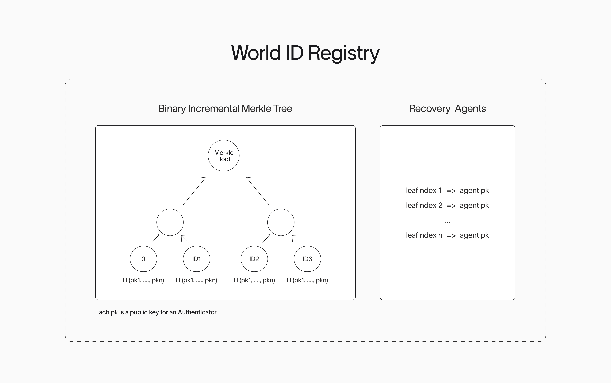
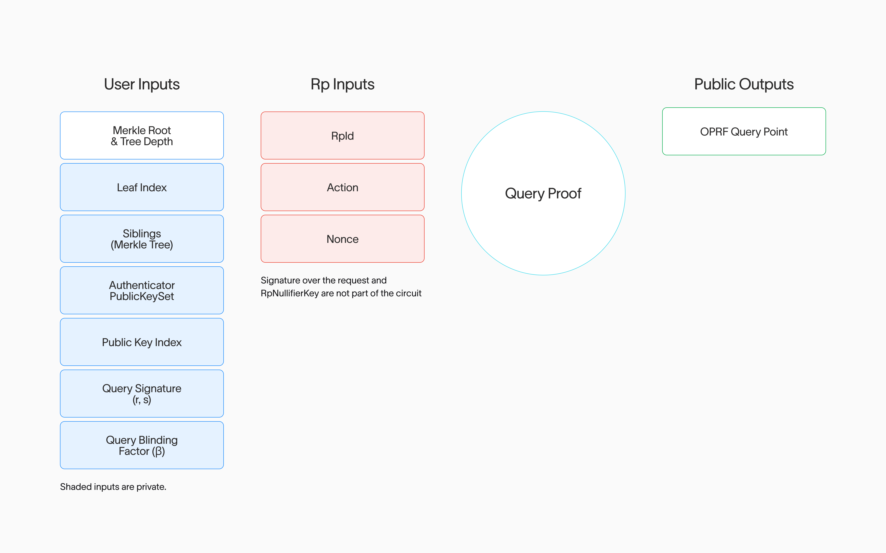

<Meta>
  <title>Introducing World ID 4.0 - Request for Comments</title>
  <description>
  The new World ID 4.0 upgrade introduces account abstraction with multi-key support, transforming a World ID from a single secret into an abstract record in a public registry. This increases protocol resilience by allowing the introduction of multiple key support, portability, recovery and improved privacy.
  </description>
  <author>Paolo D'Amico</author>
  <date>2025-12-30</date>
  <category>Research and Engineering</category>
</Meta>

## Introduction

World ID is a privacy-preserving proof of human protocol: designed to enable [World's mission](https://whitepaper.world.org/#introducing-world-network) of creating a real human network to accelerate every human in the age of AI. Since the protocol’s launch in 2023, nearly 18 million unique people have verified their humanity with World ID, bringing the network to true global operation. At that scale, however, expectations of production-grade behavior begin to collide with earlier design constraints.

In particular, a truly robust proof of human protocol must withstand key compromise, support recovery, prevent long-term linkability, and further decentralize as usage grows. Addressing these needs while preserving the guarantees of [World ID 3.0](https://world.org/blog/announcements/introducing-world-id-3-new-credentials-more-privacy-deep-fake-prevention) requires protocol-level updates.

Taken together, this motivates the next major protocol upgrade: **World ID 4.0**. In this architecture, a World ID is no longer a single long-lived secret, but an abstract account in a public registry that can authorize multiple authenticators, rotate keys, and recover if access is lost. At the same time, the protocol strengthens anonymity by enforcing true one-time-use nullifiers. The result is a protocol that is more secure, more flexible, and better suited to support a wider range of applications — all without compromising privacy. This post outlines the [proposed design of the World ID 4.0 upgrade][specs] and invites community review.

## Why a new Protocol version?

World ID is at the frontier of privacy and to remain there, the protocol must evolve and advance to address advancing privacy and security challenges posed by the next generation digital systems [^1]. A foundational change to the Protocol is required to improve security, privacy, and resilience, which in turn enables wider adoption. The **introduction of accounts in World ID** with multi-key support provides the following benefits:

- **Enabling further decentralization** ([a core requirement for proof of human](https://whitepaper.world.org/#solving-po-h-at-scale)). When a World ID is no longer bound to a single app, new apps or wallets (named Authenticators) can emerge to hold and use a World ID. What’s more, this accomplishes portability and interoperability between Authenticators because transitioning between them or using multiple ones is now possible. The net result is providing users of the protocol with increased decision power for which Authenticator to trust, including allowing the user to change their mind later.

> Definition: An *Authenticator* is a software or hardware agent (e.g., app, device, web client, or service) that controls a set of authorized keypairs for a World ID Account and is functionally capable of interacting with the Protocol, and is therefore permitted to act on that account’s behalf. _For example, an Authenticator can live in a mobile wallet or a web application. The applications may or may not be dedicated to identity (for instance a social media application may incorporate a World ID Authenticator without the need for a separate app)._

- **Rotation.** In case of compromise, the secret key can be rotated by revoking the old one.
- **Reduced attack scope.** The scope of potential past activity that could be compromised is significantly reduced, even under coercion. If an attacker gains access to a user’s unrevoked secret, the attacker cannot de-anonymize past activity without collusion of other parties.
- **Enabling recovery.** Being able to recover a World ID in case of loss of all Authenticators.
- **Authenticator plurality.** Beyond increasing resilience of the Protocol, entirely new classes of Authenticators will now be possible. For example, Authenticators that rely on secure hardware modules, or Authenticators which use more widespread identification mechanisms.
- **Granular permissions.** In the future, granular controls and permissions for different Authenticators.

This update will also bring added privacy benefits. Chief among them is the protocol-level protection for nullifier anonymity. This means that with the new protocol version, new protections are introduced so nullifiers can only ever be used once, preventing nullifiers from becoming a pseudonymous identifier. 

## Introducing World ID Accounts

Analogous to how the Ethereum ecosystem introduced [Account Abstraction](https://ethereum.org/roadmap/account-abstraction/), we propose a similar instance of accounts in the World ID Protocol. To put it another way, a World ID is no longer a single secret but an abstract record on a public on-chain registry. Here, multiple Authenticators can be authorized to act on its behalf. This registry is called the `WorldIDRegistry`.



### Nullifiers

Achieving this abstraction while maintaining user privacy is not simple. The World ID Protocol relies on something called *Nullifiers* (previously also called nullifier hashes). A nullifier is a deterministic, unguessable, and uniformly distributed number. Whenever a user presents a Proof in the World ID Protocol, they generate a nullifier for the specific provided context. This number is what provides uniqueness guarantees to a Relying Party (RP). For example, if an RP wants to ensure that a single person is only voting once on a proposal, they would request a Proof from the user where their `action = proposal1`. For a single World ID, the output nullifier will always be the same number. More simply, a nullifier can be thought of as a one-time use ticket.

**Nullifiers in World ID ≤ 3.0 [^3]**

```
   nullifier = H(rpId || action || identity_secret_key)
```

A single World ID holder will always generate the same nullifier for the same context `(rpId, action)`, which means that an RP gets a provable guarantee that this user is only doing something once (since the entire ZKP that the user provides encompasses the correct computation of the Nullifier).

Even though deterministic, the Nullifier is privacy preserving, and anonymous when correctly used. This is because it is uniformly distributed across the output space through a hashing function and critically reliant on the entropy provided by the user, which remains secret (i.e. the user's secret). The inclusion of the user’s secret in the hashing computation makes it computationally infeasible to brute-force or “guess” nullifiers.

In the updated protocol, we can no longer rely on the user's secret because there is no single secret. Further, if we were to rely on a secret that can be rotated, then the deterministic property of nullifiers would no longer hold. A single user would be able to perform an action multiple times.

**Introducing OPRF Nodes: Nullifiers in World ID 4.0**

To address this, we introduce a distributed multi-party network based on Verifiable Oblivious Pseudorandom Functions (or vOPRF for short — more about OPRF [^2]). This network, called **OPRF Nodes**, provide the required secret entropy to ensure the determinism of nullifiers. In a nutshell, these functions are analogous to keyed-hash functions where a specific input is hashed with the inclusion of a secret.

For World ID 4.0, a nullifier $n$ is computed by performing $n = \text{OPRF}(k_{rp}, DS \mid\mid \texttt{leafIndex} \mid\mid \texttt{rpId} \mid\mid \texttt{action})$ where:

- $k_{rp}$ is a secret key specific to the RP publicly committed in a smart contract. When verifying the user’s Proof, the RP verifies the nullifier was generated with their committed key.
- OPRF is the output of the function provided by each OPRF node. Importantly, a threshold of outputs must be met from different OPRF nodes for n to be correctly computed. This provides fault-tolerance and censorship-resistance. The threshold computation is accomplished because each node has an Shamir secret-share of $k_{rp}$.
- DS which stands for domain separator is a constant, specific for this context only.
- The leaf index which represents the internal identifier of a World ID is the position of the World ID in the Merkle Tree contained within the `WorldIDRegistry`.
- The `rpId` and `action` are provided by the RP to scope the Proof, similar to how it was accomplished in the previous protocol version.

Aside from providing the required entropy for computing the nullifiers, two additional requirements were set out for the OPRF Nodes. 

1. **These nodes cannot learn who the user is** (even pseudonymously), even if malicious. This is accomplished with blinded inputs.
2. **Node output can be verified**.  Discrete Logarithm Equality Proofs (DLog) are introduced to provide the verifiability to the OPRF output. When the OPRF nodes provide an evaluation on a query, they also output a DLog proof to prove that a specific publicly committed key $k_{rp}$ was used. An in-depth explanation can be found in the [TACEO OPRF Whitepaper](https://github.com/TaceoLabs/nullifier-oracle-service/blob/main/docs/oprf.pdf).

**Blinded Inputs.** When requesting an OPRF evaluation to construct the required nullifier, a user will query each OPRF node independently, and importantly, do so with blinded inputs. Instead of querying each OPRF node where the query is the user’s `leafIndex`, the user generates a random blinding factor $\beta\ \xleftarrow{\text{Unif}} \mathbb{Z}$. The user then generates their query for the server nodes as $Q = \beta \cdot H(x)$ where x represents the actual query the user intends (which in this case is the hash of the `leafIndex`, `rpId` and `action`, and the H function is a hash to field function. 

The OPRF nodes then perform the computation on the blinded query  $Q'=k\cdot Q$ . Finally, the user can un-blind the query using $\beta^{-1}$. This means deriving the output value of $H(x)\cdot k=n$ , but without any node ever learning the actual query, i.e. the nullifier is computed as $n=H'(x, (\beta^{-1}\cdot Q'))$.

Note that if the user had not performed the blinding, the OPRF nodes could easily learn the user’s `leafIndex` by trying all values (the `rpId` and `action` are public inputs). With the blinded query, however, it’s impossible for a node to know what the original query was due to the same discrete logarithm problem that makes elliptic curve cryptography secure (such as in TLS).

 The network of OPRF Nodes is made possible through the [TACEO:OPRF](https://core.taceo.io/articles/taceo-oprf/) Service.

### Anonymity

Nullifiers are already privacy preserving in the sense that they cannot be tied across multiple contexts. For example, it’s impossible to correlate two nullifiers from the same World ID for different RPs, or even two nullifiers from the same user and the same RP but different actions. This is because of the uniform distribution of the hash function to generate the nullifier. However, nullifiers could still be pseudonymous if they are used more than once; that is, if a user shares the same nullifier multiple times, then an enterprising RP could pseudonymously associate that identifier with multiple activities from a single person.

This is why the updated Protocol implements strong measures to ensure that nullifiers are truly one-time use only, attaining a sturdier guarantee of anonymity. 

Authenticators ensure a nullifier is only ever shared once. After computing a nullifier, Authenticators query an **Oblivious Nullifier Pool.** If the nullifier has been used before, the Authenticator will reject the Proof request. This pool is simply a flat list of all used nullifiers across the Protocol. Importantly, this list does not need to have any additional metadata and must be obliviously queryable.

### Sessions

In addition to verifying that a user is performing an action only once, RPs may also need to verify the same World ID holder is interacting with them again. This can be useful in several situations:

- The user wants to present a different Credential to the same RP for the same action.
    - For example, after a user presented that they have a unique government document, they now want to prove that they are also a unique human.
- The RP wants to ensure the user continues to have a valid Credential after some period of time.

This new update also introduces the concept of _Sessions_ for these use-cases, which are established between a user and an RP. A user can generate a Session Proof which proves they are still interacting with the same World ID with which the original session was established. When an RP requests a Session Proof, authenticator should display the request in a visually distinct manner, clearly signaling the difference between anonymous proofs and pseudonymous ones.

A key requirement for Session Proofs is that the RP must already know which World ID they are querying before their request. By the nature of its construction, the proof will only be valid if the same World ID is being queried.

When an RP requests an initial Uniqueness Proof, the user generates a blinding factor r. The user then computes a session ID (s), $s=H(DS_{s}\mid\mid \texttt{leafIndex}\mid\mid r)$ and provides such session ID to the RP. Later, an RP may ask the user for a Session Proof by providing the session ID. The user will attempt the computation of the session ID within a zero-knowledge circuit to match the provided session ID. If the session IDs do not match, the process fails. Importantly, Session Proofs do not repeat the nullifier from the original proof, otherwise the one-time use property would be violated.

### Proof Generation

As noted above, World ID 4.0 launches with new zero-knowledge circuits (which are still [zk-SNARK](https://vitalik.eth.limo/general/2021/01/26/snarks.html)s as in World ID ≤ 3.0). The new circuits provide additional commitments that were not available before. This post does not explain how zero-knowledge circuits work, but it describes the constraints. For an in-depth explanation of the circuits please see the [TACEO OPRF Whitepaper](https://github.com/TaceoLabs/nullifier-oracle-service/blob/main/docs/oprf.pdf).

World ID 4.0 requires the generation of two zk-SNARKs to output a single Uniqueness Proof which is presented to an RP.

### Query Proof $\pi_1$

Query Proofs are used for the Authenticator to prove to all the OPRF Nodes that it is authorized to query them on behalf of the user’s World ID— to request the evaluations required to generate the nullifier for a Proof. At a high level, this proof translates into the following assertions:

1. The user knows the secret key that matches a public key committed to for the specific `leafIndex` in the `WorldIDRegistry`.



In addition to verifying the Query Proof, the OPRF Nodes also perform a signature validation outside of the ZK circuit. Each node verifies the user has a signed message from the RP for the specific context (action and nonce) where the signature comes from a committed public key which the RP registered in the `RpRegistry`. This signals intent from the RP, and maximizes the privacy of the system. Requesting a World ID Proof requires RP consent; an attacker cannot request a proof intended for a different RP without the RP’s consent.

### Uniqueness Proof $\pi_2$

This is the final proof the user generates and provides to an RP for verification. At a high-level, it proves the following while encompassing everything proven in the Query Proof ($\pi_1$):

1. The user generated the Nullifier correctly from the outputs provided by the OPRF nodes.
2. The OPRF nodes provided the correct evaluations to generate the nullifier based on a committed public key specific to the RP.
3. The user has a correctly signed Credential signed by an Issuer with a committed public key in the `CredentialSchemaIssuerRegistry`.
    1. The user’s Credential has a `genesis_issued_at` timestamp greater or equal to the provided `min_genesis_issued_at` public input from the RP.
    2. The Credential has certain committed metadata. A subset of that committed metadata can then be verified by the OPRF nodes and the RP. For example, the expiration is verified at this step.
4. The provided signal and nonce must match the provided public inputs.


## Introducing Recovery

As described in [World’s Whitepaper](https://whitepaper.world.org/#recovery), a proof of human stack cannot be built without a *Recovery* mechanism. Should the user lose access to all their methods of authentication, they should be able to still recover their World ID using some aspect of their humanness. With World ID 4.0, and the paradigm of user accounts as records in smart contracts, recovery is now feasible. In particular, the smart contract can encode rules in an auditable way to allow recovery of a World ID.

This is accomplished through designated Recovery Agents. A user may choose to designate a trusted Recovery Agent. This Recovery Agent is then deputized with the faculty to let the user remove all their existing authenticators and register a new one. This is accomplished in the `WorldIDRegistry` which introduces a `recoverAccount` function where a Recovery Agent provides a signed message to execute the recovery. The Recovery Agent can perform this recovery operation and nothing else; it especially cannot generate proofs on behalf of the user.

A Recovery Agent does not need to be a single entity. The `WorldIDRegistry` supports a signature from another smart contract (through [EIP-1271](https://eips.ethereum.org/EIPS/eip-1271)), and this smart contract could have multiple parties and signatories to validate a recovery operation.

How a Recovery Agent performs authentication and verification to allow for a recovery is not in the scope of the Protocol. Instead, each Recovery Agent will describe its own rules and policies around enablement which is extremely important as a malicious Recovery Agent could compromise a user’s World ID. Over time, users will be able to choose one which best represents their preferences, including no Recovery Agent at all.

At launch, one Recovery Agent will be available — recovery through Orb-based biometric verification.

## State of Affairs

We have previously set out a list of [building blocks](https://whitepaper.world.org/#building-blocks) which make the universally-accessible proof of human possible. Here is how the new protocol stacks up:

| **Building Block** | **Status with World ID 4.0** | **Notes** |
| --- | --- | --- |
| **Deduplication**
Being able to uniquely identify humans. | ✅ Available | Deduplication is accomplished through the issuance of PoH-specific credentials. |
| **Authentication**
Being able to prove the person who initially enrolled is the person making a proof. | ⏳ Upcoming Protocol update | Upcoming in next update (World ID 4.1). |
| **Recovery**
Being able to get back one’s World ID and complete state in case of loss of all authentication mechanisms.  | ✅ Available | The Protocol now supports Recovery through delegated Recovery Agents. |
| **Revocation**
An issuer is able to revoke a previously issued credential (e.g. if an attacker obtained a credential fraudulently) | ⏳ Upcoming Protocol update | Upcoming in a future update. |
| **Expiry**
Efficacy of security mechanisms degrade over time, having a natural expiration addresses this. | ✅ Available | Credentials now support explicit expiration upon issuance. |

At the core of the proposal, World ID 4.0 reiterates the protocol’s commitment to [**privacy and decentralization**](https://whitepaper.world.org/#solving-po-h-at-scale) by strengthening privacy guarantees through enforced one-time-use nullifiers and introducing decentralized registries for 1) [World ID](https://github.com/worldcoin/world-id-protocol/blob/main/contracts/src/WorldIDRegistry.sol), 2) [RP](https://github.com/worldcoin/world-id-protocol/blob/main/contracts/src/RPRegistry.sol) and 3) [Credential Issuers](https://github.com/worldcoin/world-id-protocol/blob/main/contracts/src/CredentialSchemaIssuerRegistry.sol).

## Request for Comments

The product and technical specs for World ID 4.0 are [publicly available][specs]. All the Protocol components are open source and permissively licensed. A testnet will be launching soon. To all contributors to the World ID Protocol, we strongly encourage anyone to review the proposed specs, try the Protocol out and [provide comments](https://github.com/worldcoin/world-id-protocol/discussions) on the proposed World ID 4.0 update.

A special thanks to all contributors from TACEO, Tools for Humanity and World Foundation.

[specs]: https://github.com/worldcoin/world-id-protocol/blob/main/docs/world-id-4-specs/README.md


{/* REFERENCES:START */}
[^1]: [Vitalik Buterin, Does digital ID have risks even if it’s ZK-wrapped?](https://vitalik.eth.limo/general/2025/06/28/zkid.html)
[^2]: [Systematization of Knowledge Paper](https://eprint.iacr.org/2022/302.pdf)
[^3]: [Nullifiers in World ID](https://github.com/worldcoin/semaphore-rs/blob/4c21f622123b18f083db03c7ce2dca6a93a8cf34/crates/semaphore/src/protocol/mod.rs#L55)
{/* REFERENCES:END */}


{/* AUTHORS:START */}
## Authors
Paolo D'Amico
{/* AUTHORS:END */}
