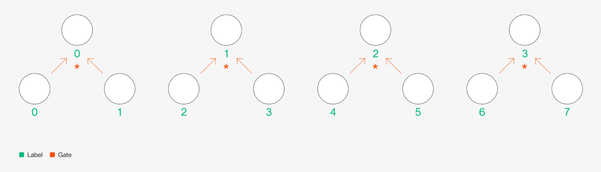
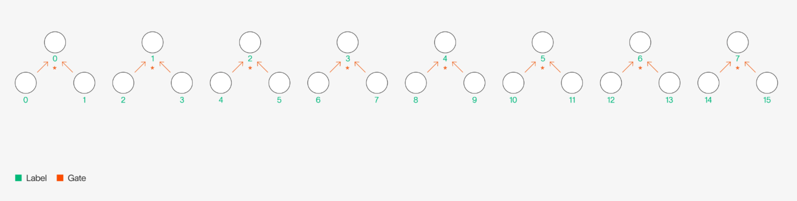

<Meta>
  <title>Remainder: World's GKR prover for ML and more</title>
  <description>
    Today we announce the open-sourcing of Remainder (Reasonable Machine Learning Doubly-Efficient Prover), Tools for Humanity's in-house GKR + Hyrax proof system. Remainder enables World's users to run ML models locally over private data and prove that they executed them correctly.
  </description>
  <date>2025-05-11</date>
  <category>Research and Engineering</category>
  <author>Ryan Cao, Vishruti Ganesh, and the Tools for Humanity Applied Research Team</author>
</Meta>

Today we'd like to announce the open-sourcing of *Remainder* (Reasonable Machine Learning Doubly-Efficient Prover), Tools for Humanity’s in-house [GKR](https://www.microsoft.com/en-us/research/wp-content/uploads/2008/01/GoldwasserKR08a.pdf) + [Hyrax](https://eprint.iacr.org/2017/1132.pdf) proof system. *Remainder* enables World’s users to run ML models locally over private data and prove that they executed them correctly, allowing powerful use-cases like on-device iris code upgrade from images without re-visiting an Orb. The **open-source codebase is available [here](https://github.com/worldcoin/Remainder_CE)** along with the companion *Remainder* Book (highly recommended!) [here](http://worldcoin.github.io/remainder-documentation). 

## Introduction

This blog covers the design decisions that went into building *Remainder.* To make it compatible with different GKR ideologies, *Remainder* includes several features that differ from typical GKR implementations:

1. **A claim-centric view of GKR** that treats it as a general claim reduction and aggregation framework, allowing support for:
    1. **"Structured" layers**, allowing for linear-time verification for a type of computation that most machine-learning algorithms fall under.
    2. **"Gate" layers**, encompassing other arithmetic computation that might not be structured.
    3. **Dataparallel layers**, which allow us to efficiently verify many executions of the same circuit.
2. **Configurable claim aggregation** strategies that trade off prover/verifier runtime and memory in explicit ways.
3. **Accessible circuit frontend** you can use to build your own circuits!

If you've been intending to dive into how GKR works in practice, this blog is for you! We'll be discussing the algorithmic ideas that make *Remainder* both surprisingly powerful and expressive for real-world ZKML.

## Background

[ZK proofs on the edge](https://world.org/blog/engineering/zkml-ai-thats-verifiable-private-and-right-on-your-phone) are critical for doing two things simultaneously: maintaining user data privacy (by keeping data strictly on users' mobile devices) while ensuring that users cannot cheat the system by running anything but the correct program.

Our goal is to constantly improve the IrisCode pipeline/algorithm, yet upgrading existing users’ IrisCodes in a secure, privacy-preserving manner is no easy feat. Broadly, there are three possible approaches: 

1. **Server-side re**-**processing:** One option—typically chosen by legacy providers—is to have users upload their iris images to our cloud and run our new IrisCode model there. While this approach maintains correctness, **it would require users to send images of themselves to our servers**.
2. **Unverified client-side execution:** Another option is to send the latest IrisCode model to every user’s mobile device and have them run the model on their iris images locally. While this approach maintains privacy, there is **no way to guarantee that users are running the correct model to upgrade their IrisCodes**. 
3. **Verified client-side execution with ZK proofs:** The third option is for us to send users the latest IrisCode model and have them run that model locally. However, rather than just blindly trusting the user's claimed result, we ask the user to also provide a proof $\pi$, which shows that the *correct* model was run on an *attested* input (i.e., an iris image which actually came from an Orb) to produce exactly the result that the user sent. **This approach maintains both privacy and correctness at the cost of runtime/RAM**.

The primary challenge here is thus performance—mobile devices are compute- and RAM-limited, and we want to make this proving capability accessible to as many devices as possible. Given this constraint, we choose to implement a prover that is specialized to our particular application: the IrisCode algorithm. 

More details can be found in [this blog](https://world.org/blog/engineering/iris-recognition-inference-system), but at a high level, the IrisCode algorithm is highly structured and layered. In other words, this algorithm can be divided into clear steps (encoded as layers of a circuit), where the output of each step is the input of the next, and almost every step can be encoded as a function whose output label is directly computable from its input label. We wish to take advantage of these two properties of the IrisCode algorithm within *Remainder*—**hence, we use the GKR proof system** with several algorithmic optimizations and a zero-knowledge wrapper over GKR proofs via the Hyrax interactive protocol.

### *Remainder* Features!

Typically, GKR is associated with two different styles of layerwise computation.

The more common style of GKR computation in literature is to use *gates*—where we define output of a computation using binary gates that dictate how to combine values in a previous computation. For example, if we want to add every other pair of values in a layer and multiply the remaining pairs of values in that same layer to result in the output of the next layer, we could define this computation using $\text{add}$ and $\text{mul}$ binary gates:

Let $f_1$ be a function over the labels of the nodes in the bottom layer, outputting the value of each node. For example, $f_1(0) = 5$ and $f_1(4) = 13$. Similarly, define $f_2$ to be a function over the top layer.

Then, one way to represent $f_2$ in terms of $f_1$ is to say:

$$
f_2(0) = f_1(0) + f_1(1) = 12 \\
f_2(1) = f_1(2) \cdot f_1(3) = 18 \\ 
f_2(2) = f_1(4) + f_1(5) = 14 \\
f_2(3) = f_1(6) \cdot f_1(7) = 22.
$$

Another style of GKR takes advantage of the structure of layers. At a high level, this is when we can notice a pattern for *which* nodes in the previous layer are combined to produce the values of the next layer. For example, in the diagram above, there is a clear pattern: we take every other pair of nodes and aggregate their values using a binary $\text{add}$ or $\text{mul}$ gate.

Alternatively, rather than spelling out each gate in the circuit and its location, we can represent $f_2$ in terms of $f_1$ in a simpler manner:

$$
f_2(i) = \begin{cases}
    f_1(2i) + f_1(2i + 1) & \text{if } i \text{ is even} \\
    f_1(2i) \cdot f_1(2i + 1) & \text{if } i \text{ is odd}.
\end{cases}

$$

We refer to this style of expressing layerwise relationships in GKR as "structured GKR." 

### GKR as a General "Claim-Reduction" Framework

Although GKR is usually compartmentalized into one of these frameworks (gate or structured), we choose to look at GKR differently—as a **claim-reduction framework**. *Remainder* takes *any* type of multilinear extension (MLE) relationship which is provable via a claim-reduction strategy of some kind (currently, this is almost exclusively sumcheck) and fits it into its claim-reduction + aggregation framework.

The key idea here is that, rather than viewing GKR as a strict protocol for evaluating layered circuits where the layerwise relationship can be expressed using indicator gate polynomials, *Remainder* views GKR as an abstract protocol with two primary (generally alternating) components: claim reduction and claim aggregation. 

- A **claim** refers to an unproven MLE evaluation the prover wishes to show is true, e.g., $\widetilde{V}_0(r_1, ..., r_n) \overset{?}{=} c_\text{out}$ (we should read this as "the verifier wishes to know whether the MLE $\widetilde{V}_0$ evaluated at public evaluation points $r_1, ..., r_n$ is indeed $c_\text{out}$").
- **Claim reduction** refers to the idea that one claim, e.g., $\widetilde{V}_0(r_1, ..., r_n) \overset{?}{=} c_\text{out}$ from above, can have its validity reduced to that of another set of claims, e.g., $\{ \widetilde{V}_1(s_1, ..., s_n) \overset{?}{=} c_1, \widetilde{V}_1(t_1, ..., t_n) \overset{?}{=} c_2 \}$, where the other set of claims is "closer" to something that is directly checkable by the verifier. (In this case, if the verifier has access to the evaluations of $\widetilde{V}_1$, then they can check the above claimed evaluations directly.)
- **Claim aggregation** refers to the idea that, given a set of claims over the same MLE, e.g., the above set $\{\widetilde{V}_1(s_1, ..., s_n) \overset{?}{=} c_1, \widetilde{V}_1(t_1, ..., t_n) \overset{?}{=} c_2\}$, we can reduce the validity of *all* such claims on that MLE to that of a single claim, e.g., $\widetilde{V}_1(u_1, ..., u_n) \overset{?}{=} c_3$.
- We note that roughly playing the following game is precisely the more general version of the GKR framework *Remainder* implements:
    - Start with circuit outputs or other direct claims the prover wishes to make.
    - For all remaining sets of claims on MLEs, do the following:
        - Aggregate the claims within the set on a single MLE to a single claim.
        - Use the claim-reduction strategy for that MLE and add remaining claims to other sets.
- The idea of a layered circuit is still natively supported within *Remainder*, but the prover and verifier are both claim-centric rather than circuit-centric—any polynomial relationship expressible in *Remainder*'s `Expression` frontend can be proven via sumcheck, and claims are agnostically accounted for and thrown into their correct layered "buckets" rather than being hard-coded.

## Claim Reduction Strategies/Layers

We briefly detail the style of polynomial relationships that *Remainder* implements. Each naturally defines one claim-reduction strategy, e.g., sumcheck over the polynomial on the RHS. 

### Linear-Time "Gate"-style Layers

See our documentation page [here](https://worldcoin.github.io/remainder-documentation/gkr_theory/canonic_gkr.html) for more details.

Recall that for "gate"-style layers, the layerwise relationship can be expressed in the form

$$
\widetilde{V}_i(g) = \sum_{x, y \in \{0, 1\}^{s_j + s_k}} \widetilde{\text{gate}}_{i, j, k}(g, x, y) \cdot \big[ \widetilde{V}_j(x) \odot \widetilde{V}_k(y)\big]
$$

where $\widetilde{\text{gate}}$ is the multilinear extension of the indicator function representing whether the $x$th wire value from the $j$th layer and the $y$th wire value from the $k$th layer contribute (via the binary $\odot$ operator, which is typically $+$ or $\times$) to the $g$th wire value in the $i$th layer for $j, k > i$. Note that $s_j, s_k$ are the number of variables in the MLE representing the $j$th and $k$th layers, respectively.

A naive implementation of a sumcheck prover for the above would require looping through all of the $x, y \in \{0, 1\}^{s_j + s_k}$ in $O(2^{s_j + s_k})$ time and computing each summand term in $O(1)$. However, using a trick from [XZZ+19], *Remainder*’s prover is able to compute the above in time $O(2^{s_i} + 2^{s_j} + 2^{s_k})$, which is linear in the size of the layers.

### Linear-Time "Structured"-style Layers

See our documentation page [here](https://worldcoin.github.io/remainder-documentation/gkr_theory/structured_gkr.html#structured-layerwise-relationship) for more details.

"Structured" layerwise relationships follow from Theorem 1 of [Tha13] and describe a relationship between layer values where bits of the index of the "destination" value in the $i$th layer are a(n optionally subset) permutation of the bits of the index of the "source" value in the $*j*$th layer for $*j > i*$. For example, a structured relationship that takes one "source" MLE $\widetilde{V}_j$ and computes products of adjacent values within it to produce $\widetilde{V}_i$ would be described as follows — 

$$
\widetilde{V}_i(g_1, g_2) = \sum_{b_1, b_2 \in \{0, 1\}^2} \widetilde{\text{eq}}(g_1, g_2; b_1, b_2) \cdot \widetilde{V}_j(b_1, b_2, 0) \cdot \widetilde{V}_j(b_1, b_2, 1)
$$

Note that the above RHS summand is cubic in $b_1, b_2$, i.e., the variables to be sumchecked over. For layerwise relationships of constant degree where $s_i$ and $s_j$ are the number of variables representing the $i$th and $j$th layers, respectively, *Remainder*’s prover runs in $O(2^{s_i} + 2^{s_j})$, i.e., linear in the size of the layers. 

When the IrisCode algorithm is expressed as an arithmetic circuit, similar to most machine learning computation, most of the circuit's layers are structured layers. By supporting linear-time proving of structured layers, we can take advantage of this fact.

### Time-Optimal Matrix Multiplication

See our documentation page [here](https://worldcoin.github.io/remainder-documentation/gkr_theory/matmult_layer.html) for more details.

We have matrices $A \in \mathbb{F}^{M \times L}, B \in \mathbb{F}^{L \times N}$ resulting in $C \in \mathbb{F}^{M \times N}$ such that $C$ is the matrix multiplication product of $B$ and $C$:

$$
C_{i, k} = \sum_{j = 0}^{L - 1} A_{i, j} \cdot B_{j, k}
$$

We extend the above matrices into MLEs:

$$
\widetilde{A}: \mathbb{F}^{<2}[X_0, ..., X_{m - 1}, Y_0, ..., Y_{\ell - 1}] \\

\widetilde{B}: \mathbb{F}^{<2}[Y_0, ..., Y_{\ell - 1}, Z_0, ..., Z_{n - 1}] \\

\widetilde{C}: \mathbb{F}^{<2}[X_0, ..., X_{m - 1}, Z_0, ..., Z_{n - 1}]
$$

The equivalent matrix multiplication relationship from above is then

$$
\widetilde{C}(X, Z) = \sum_{Y \in \{0, 1\}^\ell} \widetilde{A}(X, Y) \cdot \widetilde{B}(Y, Z)
$$

*Remainder*’s prover is able to prove this relationship for any $X, Z \in \mathbb{F}^{m + n}$ in $O(2^{m + \ell} + 2^{\ell + n})$, which is identical to the time it takes the prover to simply read the contents of $A$ and $B$, i.e., time-optimal. This allows us to reduce claims on $\widetilde{C}$ to ones on $\widetilde{A}$ and $\widetilde{B}$, as desired.

The IrisCode algorithm has a convolution, which can be represented as a matrix multiplication layer. By using this time-optimal algorithm, *Remainder* handles this layer in the most efficient way possible.

### Dataparallelism

One advantage of GKR is its support for dataparallel computation. Oftentimes, we wish to execute the same circuit over many different inputs. If the cost of verifying the execution of a circuit $C$ is $O(C)$, then naively, the cost of verifying $n$ inputs over the same circuit is $O(nC)$. However, with GKR and in *Remainder*, we have built-in support for dataparallelism, where the cost of verifying $n$ inputs over a circuit $C$ is $O(C + \log{n})$.

For simplicity, let us consider a circuit with the single layer described in the ["structured" layers section](#linear-time-structured-style-layers). Drawn out, the circuit would look like this:

 And the MLE relationship of this layer, as written earlier, is:

$$
\widetilde{V}_i(g_1, g_2) = \sum_{b_1, b_2 \in \{0, 1\}^2} \widetilde{\text{eq}}(g_1, g_2; b_1, b_2) \cdot \widetilde{V}_j(b_1, b_2, 0) \cdot \widetilde{V}_j(b_1, b_2, 1).
$$

Note that the MLEs $\widetilde{V}_i$ and $\widetilde{V}_j$ have $\log(\text{number of values})$ number of variables, because we express the label index in binary. There are eight values in the bottom layer whose pairwise product results in the next layer, and therefore $\widetilde{V}_j$ has $\log{8} = 3$ variables and $\widetilde{V}_i$ has $\log{4} = 2$ variables. 

If we wanted to validate the execution of this circuit $k$ times, over different inputs, we could simply do $k$ separate sumcheck proofs for the equation above, over the four different inputs. Sumcheck is $O(\log{n})$ work for the verifier, so this would take in total time $O(k\log{n})$. However, because GKR is so amenable to layers that have structure, another way to see this is as a single circuit, but with just $k$ times the width. If $k = 2$, we would have the following:

Then, the MLE relationship for this wider circuit would be as follows:

$$
\widetilde{V}_i(g_1, g_2, g_3) = \\
\sum_{b_1, b_2, b_3 \in \{0, 1\}^3} \widetilde{\text{eq}}(g_1, g_2, g_3; b_1, b_2, b_3) \cdot \widetilde{V}_j(b_1, b_2, b_3, 0) \cdot \widetilde{V}_j(b_1, b_2, b_3, 1).
$$

In fact, we can even think of the original layer as repeating the same (even smaller) circuit $4$ times, and the first two variables of the original $\widetilde{V}_j$ as indexing into which “copy” of the circuit we are working with. 

As opposed to above, the time it would take to verify this single sumcheck equation would be $\log{2n} = 1 + \log{n}$ as opposed to $2\log{n}$. In other words, **with dataparallelism, verification time increases by an additive logarithmic factor with the number of copies of the circuit** we would like to verify, ****as opposed to the naive strategy, which would scale linearly. 

A lot of compute in machine learning is performed in a dataparallel manner, making GKR’s natural support for dataparallel computation meaningful when applied to validating machine learning inference.

## Claim Aggregation Algorithms

See our documentation page [here](https://worldcoin.github.io/remainder-documentation/gkr_theory/claims.html) for more details!

On one hand, we have strategies to *reduce* the validity of one layer to the validity of the layers it depends on. As explained [earlier](#gkr-as-a-general-claim-reduction-framework), this results in claims on one layer "propagating" to claims on another layer. For a concrete example of how this happens, without going into too much technical detail, we start with the following "gate" layer as described above:

$$
\widetilde{V}_i(g) = \sum_{x, y \in \{0, 1\}^{2s_j}} \widetilde{\text{gate}}_{i, j}(g, x, y) \cdot \big[ \widetilde{V}_j(x) \odot \widetilde{V}_j(y)\big].
$$

To verify the claim on the value of $\widetilde{V}_i(g)$, we run the sumcheck protocol between a prover and verifier. In the last round of sumcheck, the prover sends the value $k$, which is purportedly the value:

$$
\widetilde{\text{gate}}_{i, j}(g, u, v) \cdot \big[ \widetilde{V}_j(u) \odot \widetilde{V}_j(v)\big].
$$

To verify this, the verifier needs $\widetilde{V}_j(u)$ and $\widetilde{V}_j(v)$, which are sent as claims from the prover:

$$
c_0 \overset{?}= \widetilde{V}_j(u)\\
c_1 \overset{?}= \widetilde{V}_j(v).

$$

And the verifier can verify these claims by performing sumcheck over another GKR layer. However, as we can see, one claim on the layer $\widetilde{V}_i$ resulted in two claims on the layer $\widetilde{V}_j$. For a circuit which contains $n$ layers, this will result in a number of claims on the final layer proportional to $2^n$. To avoid this blow-up, we engage in a protocol called "claim aggregation," which, in exchange for a negligible soundness hit, reduces the validity over $m$ claims to the validity of a single claim or a single sumcheck equation, depending on the strategy. 

In *Remainder*, we allow circuit builders to configure which strategy of claim aggregation they would like to use, depending on which constraints they are optimizing for. We are able to do this because we view claim aggregation as a separate framework.

### Interpolative Claim Aggregation

At a high level, interpolative claim aggregation works by taking $m$ claims on an MLE and fitting each of the claimed *points* to a line. In other words, if we have the following claims:

$$
\widetilde{V}_i(g_1^{(1)}, ..., g_n^{(1)}) \overset{?}{=} c_i^{(1)} \\\widetilde{V}_i(g_1^{(2)}, ..., g_n^{(2)}) \overset{?}{=} c_i^{(2)} \\\vdots \\\widetilde{V}_i(g_1^{(m)}, ..., g_n^{(m)}) \overset{?}{=} c_i^{(m)}
$$

then both the prover and the verifier compute the following interpolating polynomial $\ell$ such that:

$$
\ell(1) = g_1^{(1)}, ..., g_n^{(1)} \\\ell(2) = g_1^{(2)}, ..., g_n^{(2)} \\\vdots \\\ell(m) = g_1^{(m)}, ..., g_n^{(m)}.
$$

Then, the prover sends to the verifier the polynomial $\widetilde{V}_i \circ \ell$, or in other words, the restriction of $\widetilde{V}_i$ to points generated by $\ell$. The verifier then chooses a random point $r^\star$, where $\ell(r^\star) = (r^\star_1, \dots, r^\star_n)$. The prover and verifier then engage in a single sumcheck to verify whether $\widetilde{V}(r^\star_1, \dots, r^\star_n) \overset{?}{=} (\widetilde{V}_i \circ \ell)(r^\star)$.

The majority of the cost here comes from the degree blow-up of $\widetilde{V}_i \circ \ell$, which is $O(mn)$.

We have implemented several optimizations within *Remainder* to reduce the degree of this polynomial and therefore reduce the complexity of this method of claim aggregation. However, in some cases, we may still opt for a different type of claim aggregation, which comes with a different set of trade-offs.

### Random Linear Combination (RLC) Claim Aggregation

RLC claim aggregation, contrary to the name, does not aggregate claims at all. Instead, it “folds” all of the claims into a single sumcheck equation. For the sake of brevity, we show how RLC claim aggregation works for structured layers. For more detail, we highly recommend reading our [documentation page](https://worldcoin.github.io/remainder-documentation/gkr_theory/claims.html)!

Recall our example for a structured layer’s sumcheck equation:

$$
\widetilde{V}_i(g_1, g_2) = \sum_{b_1, b_2 \in \{0, 1\}^2} \widetilde{\text{eq}}(g_1, g_2; b_1, b_2) \cdot \widetilde{V}_j(b_1, b_2, 0) \cdot \widetilde{V}_j(b_1, b_2, 1).
$$

If we have the set of claims:

$$
\widetilde{V}_i(g_1^{(1)}, g_2^{(1)}) \overset{?}{=} c_i^{(1)} \\\widetilde{V}_i(g_1^{(2)}, g_2^{(2)}) \overset{?}{=} c_i^{(2)} \\\vdots \\\widetilde{V}_i(g_1^{(m)}, g_2^{(m)}) \overset{?}{=} c_i^{(m)}
$$

then we have $m$ sumcheck equations:

$$
\widetilde{V}_i(g_1^{(1)}, g_2^{(1)}) = \sum_{b_1, b_2 \in \{0, 1\}^2} \widetilde{\text{eq}}(g_1, g_2; b_1, b_2) \cdot \widetilde{V}_j(b_1, b_2, 0) \cdot \widetilde{V}_j(b_1, b_2, 1) \\
\vdots \\
\widetilde{V}_i(g_1^{(m)}, g_2^{(m)}) = \sum_{b_1, b_2 \in \{0, 1\}^2} \widetilde{\text{eq}}(g_1, g_2; b_1, b_2) \cdot \widetilde{V}_j(b_1, b_2, 0) \cdot \widetilde{V}_j(b_1, b_2, 1).

$$

Instead of engaging in $m$ sumchecks, however, we take the random linear combination of each of the claims. In other words, let the random coefficients be $\alpha_1, \dots, \alpha_m$. Then, we compute the claim $c_i^{(\alpha)} = \sum_j \alpha_jc_i^{(j)}$, and perform sumcheck over the single equation:

$$
c_i^{(\alpha)} \overset{?}= \sum_{b_1, b_2 \in \{0, 1\}^2} \bigg[ 
\sum_j\Big(\alpha_j \cdot \widetilde{\text{eq}}(g_1^{(j)}, g_2^{(j)}; b_1, b_2) \Big) \bigg] \cdot \widetilde{V}_j(b_1, b_2, 0) \cdot \widetilde{V}_j(b_1, b_2, 1).
$$

Here, the added cost comes from the larger sumcheck equation. In *Remainder,* we have several optimizations that take advantage of the structure of the $\widetilde{eq}$ MLE. RLC claim aggregation is often the more performant choice of claim aggregation; however, due to the structure of some layers, such as [matmult](#time-optimal-matrix-multiplication) layers, interpolative claim aggregation may be necessary. Therefore, we offer the option to choose which claim aggregation method to use!

## Circuitization Frontend

Finally, we offer an extremely accessible interface to build circuits yourself in *Remainder.* We highly recommend checking out our [quickstart](https://worldcoin.github.io/remainder-documentation/quickstart.html) if you would like to get started right away! It offers a step-by-step guide to building your own circuit and running the proving/verifying process within *Remainder*.

Additionally, if you would like to learn more about the theory and the math behind what goes into *Remainder,* we wrote a comprehensive overview in our [*Remainder* Book](https://worldcoin.github.io/remainder-documentation), along with extra resources that helped us understand GKR and Hyrax!

## Conclusion

If you made it down here, thanks so much for reading this blog post, and we hope you enjoyed it! We are always looking for suggestions, ideas for features, and feedback on *Remainder*, so please check out our [codebase](https://github.com/worldcoin/Remainder_CE). 

If you're interested in working on problems related to privacy-preserving proof-of-humanity, we're always looking for excited people to join Tools for Humanity—check out our careers page [here](https://www.toolsforhumanity.com/careers#positions).

Catch you next time!

*[Ryan Cao](https://x.com/nayr_oac), [Vishruti Ganesh](https://vishruti.me/), and the Tools for Humanity Applied Research Team*

### References

1. [Modulus Labs. (2024). Scaling Intelligence: Verifiable Decision Forest Inference with *Remainder.*](https://github.com/Modulus-Labs/Papers/blob/master/remainder-paper.pdf)
2. [Justin Thaler. (2013). Time-Optimal Interactive Proofs for Circuit Evaluation.](https://ia.cr/2013/351)
3. [Justin Thaler. (2013). Proofs, Arguments, and Zero-Knowledge.](https://people.cs.georgetown.edu/jthaler/ProofsArgsAndZK.pdf)
4. [Riad S. Wahby, Ioanna Tzialla, abhi shelat, Justin Thaler, & Michael Walfish. (2017). Doubly-efficient zkSNARKs without trusted setup.](https://ia.cr/2017/1132)
5. [Riad S. Wahby, Ye Ji, Andrew J. Blumberg, abhi shelat, Justin Thaler, Michael Walfish, & Thomas Wies. (2017). Full accounting for verifiable outsourcing.](https://ia.cr/2017/242)
6. [Tiancheng Xie, Jiaheng Zhang, Yupeng Zhang, Charalampos Papamanthou, & Dawn Song. (2019). Libra: Succinct Zero-Knowledge Proofs with Optimal Prover Computation.](https://ia.cr/2019/317)
